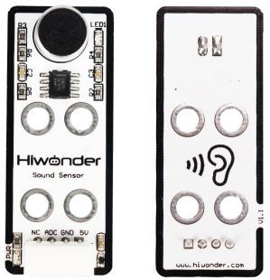
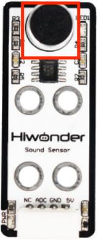
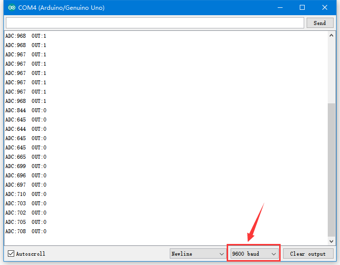

# 1. Sound Sensor Manual

## 1.1 Sound Sensor Description

### 1.1.1 Sensor Introduction

This sound Sensor is designed for external volume detection. This sensor features a wide range of applications, suitable for use in voice-controlled robots, switches, alarms, and similar devices.

### 1.1.2 Working Principle

The sensor is constituted of a microphone and LM358 chip. Its working principle is to convert sound vibrations at the microphone into electrical signal output. The microphone capsule can be used as a condenser electric microphone. Sound waves cause the electric film inside the microphone to vibrate, resulting in a change in capacitance and a corresponding change in tiny voltage. And the tiny voltage passes through an amplification circuit designed with the LM358 chip, then is converted to a 0–5 V signal and received by the data acquisition device via A/D conversion.

## 1.2 Notice

1.  Do not exceed the rated voltage range during use.

2.  If the detected sound is too small, it may affect the output signal of the sensor.

## 1.3 Specifications

For more information, you may refer to **"[Sound sensor schematic](https://drive.google.com/drive/folders/11CKIRmvLYKgek4l_EWTRR-dvQXqoqyYN?usp=sharing)"**

### 1.3.1 Pin Instruction

| **Pin** | **Instruction**                                              |
| :------ | :----------------------------------------------------------- |
| 5V      | Power Input                                                  |
| GND     | Ground                                                       |
| ADC     | The sensor output pin outputs an analog level, which indicates the detected sound intensity. The range is 0~1023 (10-bit ADC). The greater the sound intensity, the larger the value. |
| NC      | None                                                         |

### 1.3.2 Specifications

<table class="docutils-nobg" border="1">
<colgroup>
<col style="width: 50%" />
<col style="width: 50%" />
</colgroup>
<tbody>
<tr>
<td colspan="2" style="text-align: center;">

<strong>Sound Sensor</strong>

</td>
</tr>
<tr>
<td style="text-align: center;">

<strong>Parameter</strong>

</td>
<td style="text-align: center;">

<strong>Specification</strong>

</td>
</tr>
<tr>
<td style="text-align: center;">

<strong>Power Supply</strong>

</td>
<td style="text-align: center;">

<strong>DC 5V</strong>

</td>
</tr>
<tr>
<td style="text-align: center;">

<strong>Operating Current</strong>

</td>
<td style="text-align: center;">

<strong>5mA</strong>

</td>
</tr>
<tr>
<td style="text-align: center;">

<strong>Microphone Type</strong>

</td>
<td style="text-align: center;">

<strong>Electret Condenser</strong>

</td>
</tr>
<tr>
<td style="text-align: center;">

<strong>Indicator Light (PWR) Description</strong>

</td>
<td style="text-align: center;">

<strong>The PWR LED lights up when powered.</strong>

</td>
</tr>
<tr>
<td style="text-align: center;">

<strong>LED1</strong>

</td>
<td style="text-align: center;">

<strong>Lights up when sound is detected</strong>

</td>
</tr>
<tr>
<td style="text-align: center;">

<strong>Connector Type</strong>

</td>
<td style="text-align: center;">

<strong>5264-4AW</strong>

</td>
</tr>
<tr>
<td style="text-align: center;">

<strong>Product Dimensions</strong>

</td>
<td style="text-align: center;">

<strong>50mmx20mm</strong>

</td>
</tr>
<tr>
<td colspan="2" style="text-align: center;">

<strong>Modular installation, compatible with Lego series.</strong>

</td>
</tr>
</tbody>
</table>

## 1.4 Project Outcome

You can refer to the case tutorials and programs for different platforms in the same directory as this tutorial. This section will demonstrate the testing effect using Arduino IDE as an example.

When you speak into the microphone of the sound sensor and the sensor detects the sound signal, LED1 on the sensor lights up. The louder the voice, the larger the value displayed on the serial monitor.

