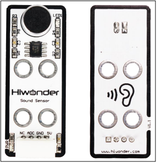
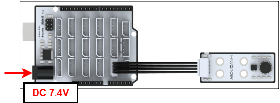
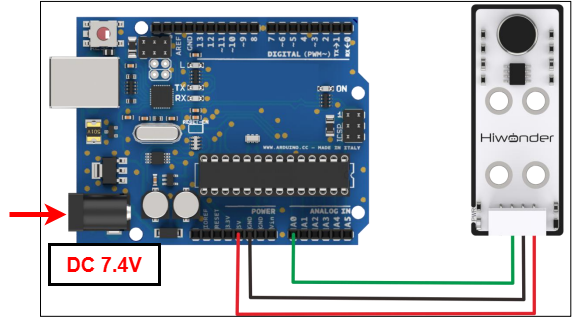
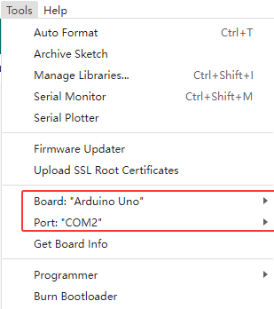
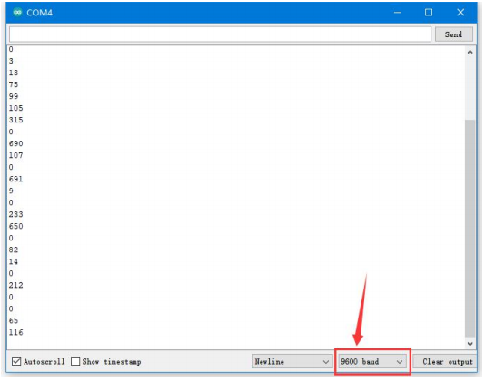

# 2. Arduino Development



## 2.1 Getting Started

### 2.1.1 Wiring Instruction

This section illustrates connecting a 4-pin cable to the A2 and A3 ports on the Arduino expansion board. Refer to the diagram below.



If you do not have an Arduino expansion board, use a Dupont wire to directly connect to the Arduino development board, just as below:



> [!NOTE]
>
> * When using Hiwonder's lithium battery, connect the battery cable with the red wire to the positive (+) terminal and the black wire to the negative (–) terminal of the DC port.
>
> * If the battery is not connected to the cables, do not connect the cable ends directly together. Doing so may cause a short circuit and damage the system.
>
> * Before powering on, ensure that no metal objects are touching the controller. Otherwise, the exposed pins at the bottom of the board may cause a short circuit and damage the controller.

### 2.1.2 Environment Configuration

Install the Arduino IDE on your computer. The software package is located in "**[Appendix-> Arduino Installation Package](https://drive.google.com/drive/folders/1y_lx7fLvcutHlpGCEodyQPhXaQjS8uCZ?usp=sharing).**" For the detailed operations of Arduino IDE, please refer to the same directory.

## 2.2 Test Case

Program to display the values detected by the sound sensor in the terminal window.

### 2.2.1 Program Download

1. For the Arduino and UNO development board equipped with the expansion board, use a USB cable to connect them to the computer. You can open Arduino IDE, click “**File → New**,” and import the program located in the same directory as this tutorial.

2. Remember to select the correct development board and port. The ports shown below are for reference only. Then compile and upload the program.



3. After the code is uploaded, click  to open the serial monitor, set the baud rate to 9600 to observe the output.

### 2.2.2 Project Outcome

When you speak into the microphone of the sound sensor and the sensor detects the sound signal, LED1 on the sensor lights up. The louder the voice, the larger the value displayed on the serial monitor.



### 2.2.3 Program Brief Analysis

- **Custom interfaces**

```c++
#define SOUND A0   //The ADC terminal of the sound sensor is connected to A0 on the control board
uint16_t volume;
```

Initially, program to define the sound sensor's interface, connecting the ADC pin to A0. The volume stores ADC sample values.

- **Serial Port Initialization**

```c++
void setup()
{
  Serial.begin(9600);
  pinMode(SOUND, INPUT);
}
```

After initializing the serial port here, set pin A0 to input mode.

- **Loop Process**

```c++
void setup()
{
  volume = analogRead(SOUND);   //0-1023
  Serial.println(volume);
  delay(100);
}
```

In the `loop()` function, read the ADC value from the A0 pin using `analogRead` and store it in the volume variable, range 0–1023. Then print the value to the serial monitor.