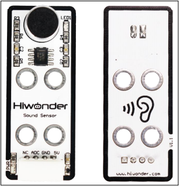
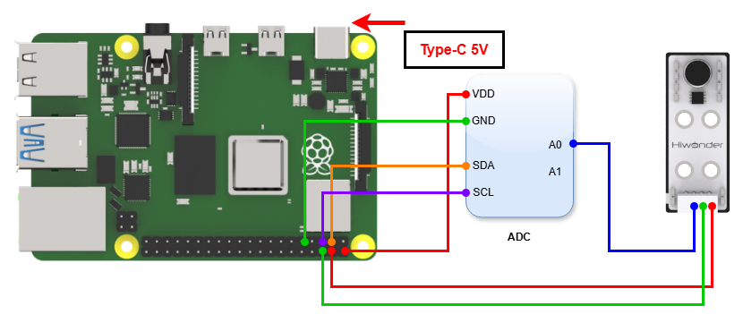
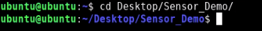
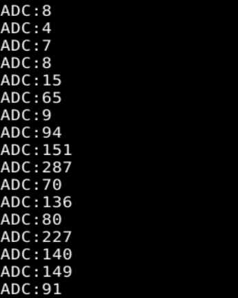
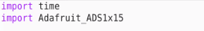
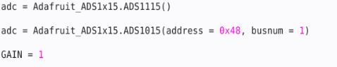
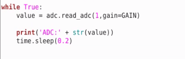

# 3. Raspberry Pi Development Tutorial

## 3.1 Getting Started

### 3.1.1 Wiring Instruction

This section uses DuPont wire to connect the sound sensor and the ADC digital-to-analog conversion module as an example.For wiring instructions, refer to the figure below:

> [!NOTE]
>
> * When using Hiwonder's lithium battery, connect the battery cable with the red wire to the positive (+) terminal and the black wire to the negative (–) terminal of the DC port.
>
> * If the battery is not connected to the cables, do not connect the cable ends directly together. Doing so may cause a short circuit and damage the system.
>
> * Before powering on, ensure that no metal objects are touching the controller. Otherwise, the exposed pins at the bottom of the board may cause a short circuit and damage the controller.

### 3.1.2 Environment Configuration

Install NoMachine on your computer. The software package is located under "**[Appendix-> Remote Desktop Connection Tool](https://drive.google.com/drive/folders/1ZDEDsxHShCwPgf0YMqRRz5CgHqqDBvkj?usp=sharing)**" For the detailed operations of NoMachine, please refer to the same directory.

> [!NOTE]
>
> **This example uses the ADS1115 external ADC conversion module. If you use other modules, you need to download the corresponding library file.**

In this case, you need to download the library file through pip. Make sure the Raspberry Pi is connected to the network, open a terminal window, and enter the following code:

"**sudo pip3 install Adafruit_ADS1x15**"

After installing the library file successfully, open the terminal and enter the following command to switch to the directory where the program is located:

"**sudo chmod a+x Sensor_Demo/**"

## 3.2 Test Case

Program to display the values detected by the sound sensor in the terminal window.

### 3.2.1 Program Download

1. Open the terminal and enter the following command to navigate to the program directory:

"**cd Desktop/Sensor_Demo/**" and press Enter.

2. Run the program by entering:

"**python3 SoundSensorDemo.py** "

### 3.2.2 Project Outcome

When you speak into the microphone of the sound sensor and the sensor detects the sound signal, LED1 on the sensor lights up. The louder the voice is, the larger the value displayed in the Raspberry Pi terminal window will be.

### 3.2.3 Program Brief Analysis

- **Import Libraries**

Import required library files, including `Adafruit_ADS1x15`, the external ADC module library.

Since the Raspberry Pi does not have an ADC converter, you need to use an external ADC conversion module to realize AD conversion. In this example, the ADS1115 module is used for demonstration. Any ADC module can be used according to actual needs.

- **Initialization**

Instantiate the `adc` object and set the `adc` object to read port A1 of the ADC module.

- **Main Program**

Store the data output from port A1 of the `ADC` module into value, and then print the content of value in the Raspberry Pi terminal window.