# 4. Arduino IDE Installation

## 4.1 Arduino Software Installation

Arduino IDE is a software specially designed for Arduino single-chip microcomputer, with powerful functions. No matter which versions, they have same installation processes. Take the windows version of Arduino-1.8.12 software version as an example:

1)  Go to folder "**[Arduino Installation Package](https://drive.google.com/drive/folders/1y_lx7fLvcutHlpGCEodyQPhXaQjS8uCZ?usp=sharing)**", double-click to run the file "**arduino-1.8.5-windows.exe**".

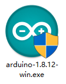

2)  Click "**I Agree**" to install it.

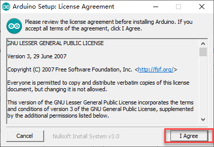

3)  Select default options, click "**Next**" to enter the next step.

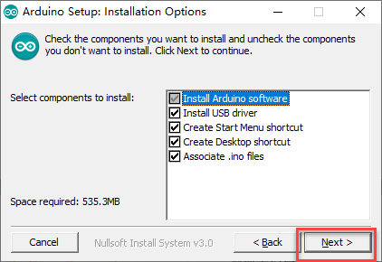

4)  Click "**Browser**" to select destination folder to install, and then click "**Install**" button.

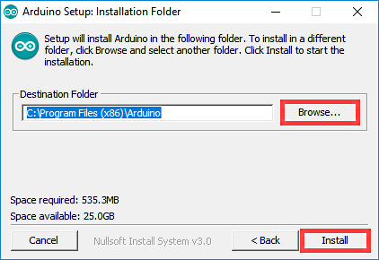

5)  Wait for the program installation to complete.

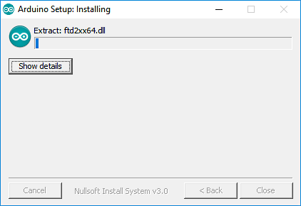

6)  If prompted to install the chip driver during the installation process, click "**Install**" button.

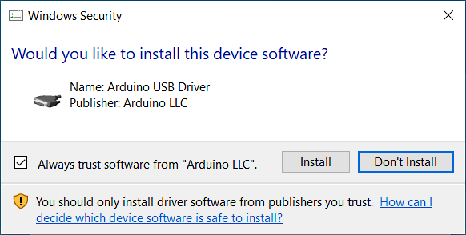

7)  After Installing, click "**close**" button.

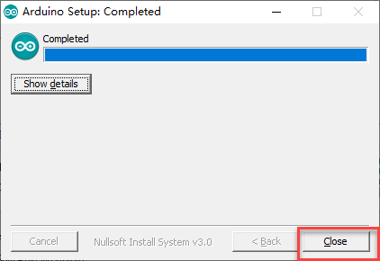

## 4.2 Software Introduction

1)  Double click to open Arduino IDE.

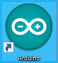

2)  Interface of the Arduino IDE as shown below.

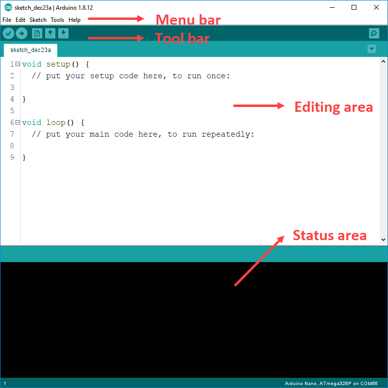

3)  Click to select "**File->Preferences**". In the pop-up window, you can set the IDE project save location, language, font size, line number, etc.

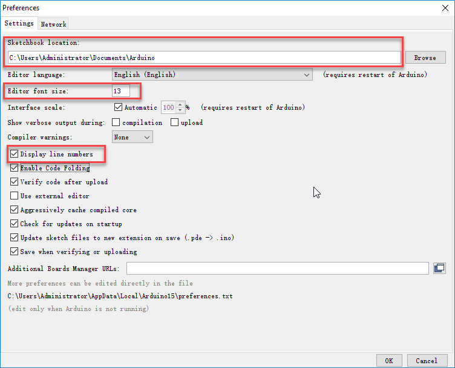

4)  Main function of Arduino IDE interface: 1.Toolbar 2.Project preference 3.Serial monitor 4.Code editing area 5. Debugging prompt area.

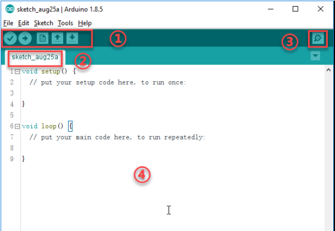

5)  On the toolbar, Arduino IDE provides shortcut keys for common functions, as shown in the following table:

| Toolbar Icon                                                 | Function                                                     |
| ------------------------------------------------------------ | ------------------------------------------------------------ |
|  | Correction Verify whether a program is written correctly, and if it is correct, compile the project. |
|  | Download, Download program to the Arduino controller         |
|  | Create a new project                                         |
|  | Open a project.                                              |
|  | Save a project.                                              |
|  | Serial monitor can check the data sent or received by the serial port. |

